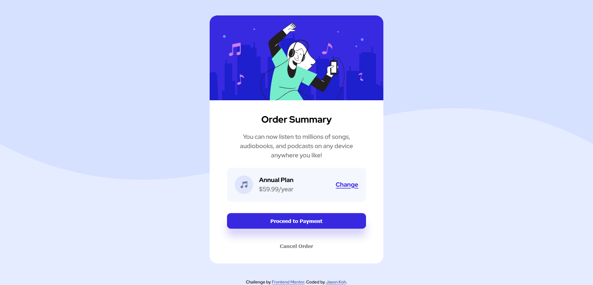

# Frontend Mentor - Order summary card solution

## Overview

### The Challenge
The challenge is to build out this order summary card component and get it looking as close to the design above as possible.

This is my solution to the [Order summary card challenge on Frontend Mentor](https://www.frontendmentor.io/challenges/order-summary-component-QlPmajDUj). Frontend Mentor challenges help you improve your coding skills by building realistic projects.

I've decided to complete this mini-project using HTML & SCSS.

### Solution Screenshot

### Below is a link to my solution

- Solution URL: [Code on Github](https://github.com/jasonkwm/order-summary-component-main)
- Live Site URL: [Live site on vercel](https://order-summary-component-main-tan.vercel.app/)

## My Process

### Build with
- HTML 
- SASS
- No Figma/Sketch files

### What I learn
- Mobile view first
- Box Sizing
- Css resets are super useful
- Css specificity

